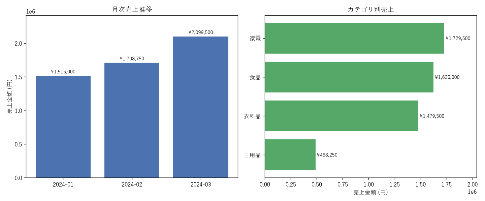

# 売上データ集計・レポート自動化（サンプル）

複数月に分かれた売上CSVを1つにまとめ、月次・カテゴリ別・店舗別に自動集計して、
**Excelレポート**と**グラフ画像**を出力するサンプルです。
毎月手作業でExcelに貼り付け・関数・グラフ作成…を繰り返している作業を、スクリプト1本で置き換えます。

## 集計結果のグラフ



## できること

- `raw/` 内の **複数CSV（月別ファイル）を自動で統合**（ファイルが増えても変更不要）
- `売上金額 = 数量 × 単価` を自動計算
- **月次推移 / カテゴリ別（構成比%付き）/ 店舗別** に集計
- 結果を **4シートのExcel**（月次推移・カテゴリ別・店舗別・明細）に出力
- **棒グラフ + 横棒グラフ**をPNG画像で出力（日本語ラベル対応）

## 集計結果（入力36行 / 2024-01〜03）

**月次売上**

| 月 | 売上金額 | 数量 |
|---|---:|---:|
| 2024-01 | ¥1,515,000 | 1,125 |
| 2024-02 | ¥1,708,750 | 1,295 |
| 2024-03 | ¥2,099,500 | 1,440 |
| **合計** | **¥5,323,250** | **3,860** |

**カテゴリ別**

| カテゴリ | 売上金額 | 構成比 |
|---|---:|---:|
| 家電 | ¥1,729,500 | 32.5% |
| 食品 | ¥1,626,000 | 30.5% |
| 衣料品 | ¥1,479,500 | 27.8% |
| 日用品 | ¥488,250 | 9.2% |

**店舗別**

| 店舗 | 売上金額 |
|---|---:|
| 渋谷店 | ¥2,009,000 |
| 新宿店 | ¥1,727,750 |
| 大阪店 | ¥1,586,500 |

## ファイル構成

```
sales-report-sample/
├─ raw/
│  ├─ sales_2024-01.csv     月別の売上データ（入力）
│  ├─ sales_2024-02.csv
│  └─ sales_2024-03.csv
├─ aggregate.py             集計・可視化スクリプト
├─ output/
│  ├─ 売上集計.xlsx          4シートのExcelレポート
│  └─ 月次売上推移.png        グラフ画像
└─ README.md
```

## 使い方

```bash
pip install -r requirements.txt
python aggregate.py
```

`raw/` に `sales_YYYY-MM.csv` を追加して再実行すれば、その月も自動で集計に含まれます。

## 技術メモ

- 複数ファイルの統合: `Path.glob("sales_*.csv")` → `pd.concat`
- 集計: `groupby` + `agg`（合計・構成比の算出）
- Excel複数シート出力: `pd.ExcelWriter`（openpyxl）
- グラフ: matplotlib（Windows標準の Yu Gothic を指定し日本語ラベルに対応）
- 環境: Python 3 / pandas / openpyxl / matplotlib

---
*列名・集計軸（週次/担当者別など）・グラフ種類・出力形式は、ご要望に合わせて調整できます。*
